# MediApp Architecture Diagram

## System Architecture Overview


---

## Booking Flow Sequence

```mermaid
sequenceDiagram
    autonumber
    participant C as 👤 Client
    participant GW as 🚪 Gateway
    participant SEC as 🔐 Security
    participant BOOK as 📅 Booking Service
    participant DOC as 👨‍⚕️ Doctor Service
    participant RMQ as 📨 RabbitMQ
    participant NOTIF as 🔔 Notification Service

    Note over C,NOTIF: Authentication Flow
    C->>GW: POST /login (credentials)
    GW->>SEC: Forward auth request
    SEC-->>GW: JWT Token
    GW-->>C: JWT Token

    Note over C,NOTIF: Booking Flow
    C->>GW: POST /api/v1/appointments/book<br/>(with JWT)
    GW->>GW: Validate JWT
    GW->>BOOK: Forward booking request
    BOOK->>DOC: GET /availability/{doctorId}
    DOC-->>BOOK: Available slots
    BOOK->>DOC: PUT /availability/{slotId}/reserve
    DOC-->>BOOK: Slot reserved
    BOOK->>BOOK: Persist appointment
    BOOK->>RMQ: Publish AppointmentCreatedEvent
    BOOK-->>GW: Appointment confirmation
    GW-->>C: Appointment confirmation

    Note over RMQ,NOTIF: Async Notification
    RMQ-->>NOTIF: Consume event
    NOTIF->>NOTIF: Send Email/SMS
    NOTIF->>NOTIF: Log notification
```



---

## Service Communication Matrix

```mermaid
graph LR
    subgraph Sync["Synchronous (HTTP/REST)"]
        direction TB
        A1["Gateway → All Services"]
        A2["Booking → Doctor Service"]
        A3["User → Doctor Service"]
    end

    subgraph Async["Asynchronous (RabbitMQ)"]
        direction TB
        B1["Booking Service<br/>(Producer)"]
        B2["Notification Service<br/>(Consumer)"]
        B1 -->|"appointment-created<br/>appointment-cancelled"| B2
    end

    subgraph Discovery["Service Discovery"]
        direction TB
        C1["All Services"]
        C2["Eureka Server"]
        C1 -.->|register/discover| C2
    end
```



---

## Database Schema Relationships

```mermaid
erDiagram
    APP_USER ||--o| PATIENT_PROFILE : has
    APP_USER ||--o| DOCTOR_PROFILE : has
    DOCTOR_PROFILE }o--|| SPECIALTY : belongs_to
    DOCTOR_PROFILE ||--o{ AVAILABILITY_SLOT : offers
    AVAILABILITY_SLOT ||--o| APPOINTMENT : reserved_by
    APPOINTMENT }o--|| APP_USER : patient
    APPOINTMENT }o--|| DOCTOR_PROFILE : doctor
    NOTIFICATION_LOG }o--|| APP_USER : recipient

    APP_USER {
        bigint user_id PK
        bigint auth_user_id UNIQUE
        varchar email
        varchar first_name
        varchar last_name
        enum user_role
    }

    PATIENT_PROFILE {
        bigint patient_id PK_FK
        varchar phone_number
        date date_of_birth
    }

    DOCTOR_PROFILE {
        bigint doctor_id PK_FK
        bigint user_id FK
        varchar medical_license_number
        int specialty_id FK
        varchar office_address
    }

    SPECIALTY {
        int specialty_id PK
        varchar name
    }

    AVAILABILITY_SLOT {
        bigint slot_id PK
        bigint doctor_id FK
        datetime start_time
        datetime end_time
        boolean is_reserved
    }

    APPOINTMENT {
        bigint appointment_id PK
        bigint patient_id
        bigint doctor_id
        bigint slot_id
        date appointment_date
        time start_time
        enum status
        datetime created_at
    }

    NOTIFICATION_LOG {
        bigint log_id PK
        bigint recipient_user_id
        enum message_type
        varchar topic
        boolean sent_success
        datetime sent_at
    }
```

---

## Technology Stack


---

## Port Reference

| Service                   | Port  | Protocol |
| ------------------------- | ----- | -------- |
| Discovery Server (Eureka) | 8761  | HTTP     |
| Gateway Service           | 8550  | HTTP     |
| User Service              | 8081  | HTTP     |
| Doctor Service            | 8082  | HTTP     |
| Booking Service           | 8083  | HTTP     |
| Notification Service      | 8084  | HTTP     |
| Security Service          | 8085  | HTTP     |
| MySQL                     | 3306  | TCP      |
| RabbitMQ                  | 5672  | AMQP     |
| RabbitMQ Management       | 15672 | HTTP     |
